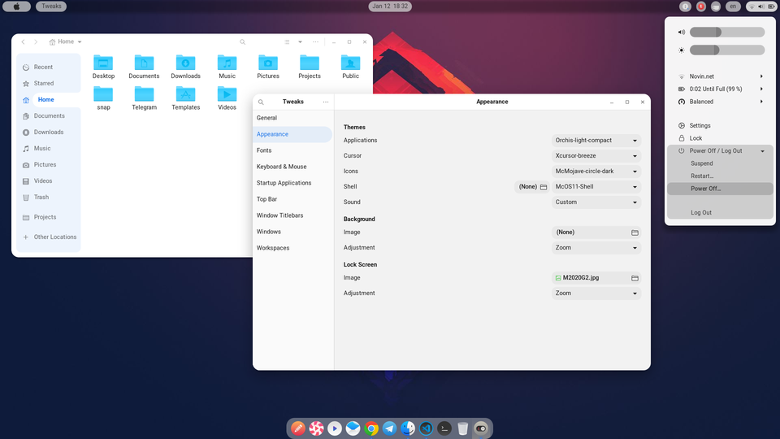

# MyCustomeLinux

Gnome Customization, Look Like MacOS

## Desktop Screenshot

#

## My OS Information

- Manjaro Linux
- x86_64 GNU/Linux
- GNOME Shell 41.2

  

#

## Installation

### Update & Upgrade

    sudo pacman -Syyu

### Install AUR Repository

    sudo pacman -S yay
    yay -Sy

### Install Persian Font

    yay -S vazir-fonts

### Install Plank

    sudo pacman -S plank

  

#

## GTK Theme

### Extract _./src/McOs/Icons/01-McMojave-circle_ To **/usr/share/icons**

  

## Gnome Shell Theme

### Extract _./src/McOs/Icons/01-McMojave-circleshell/mcOS11-Shell_ and _./src/McOs/shell/Orchis/Orchis-dark-compact_ To **/home/USER/.themes**

  

## Plank Theme

### Extract _./src/McOs/Plank/mcOS-BS-White-MOD-NS_ To **/usr/share/plank/themes**

  

## Fonts

### Extract and Install _./src/McOs/Fonts/JetBrainsMono-1.0.2_ By Manjaro-Fonts

  

## Gnome Extention

### From Gnome-Extention-App Disable

- Dash to Dock
- Dash to Panel

### Then Install and Active User Themes From

`https://extensions.gnome.org/extension/19/user-themes/`

### and Hide TopBar From

`https://extensions.gnome.org/extension/545/hide-top-bar/`
  

#

## Config System

 

### By Tweaks Set The Following Options

#### in Appearance:

- Applications --> Orchis-light-compact
- Icons --> McMojave-circle-dark
- Shell --> McOS11-Shell

#### in Fonts:

- Interface Text --> Vazir UI Medium 11
- Document Text --> Vazir UI Medium 11
- Monospace Text --> Vazir Medium 11
- Legacy Window Titles --> Vazir Bold 11

### in Startup Applications

- Append Plank To Startup

 

### Plank Preferences

#### in Appearance

- Theme --> mc-OS-BS-White-MOD-NS
- Alignment --> Center
- Icon Size --> 38
- Icon Zoom --> 125
